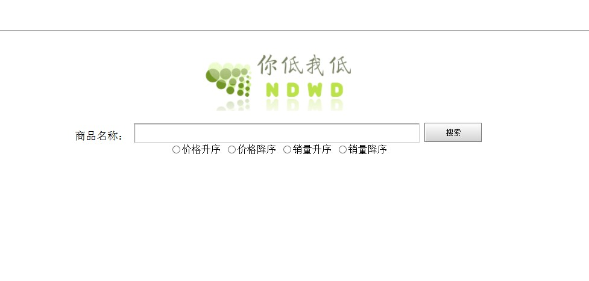

#你低我低 是什么? (Introduction)
* 你低我低 致力于建设绝无人工干预的比价网站
* 现支持淘宝、亚马逊
* 支持自定义排序方式

网站截图
  

站点尚未发布，请谅解，试链接地址：http://ndwd.azurewebsites.net/1.php

---
#你低我低 的创新点 (Innovation)
* 绝无人为干预
* 实时抓取，准确无误
* 开源项目，可拓展性高

---
#你低我低 的项目前景 (Foreground)
* 增加电商数目
* 增加自定义比价功能
* 添加订单管理功能
* 逐步建立起一个集搜索比价，订单管理，售后联系为一体的一站式网站

---
#你低我低 的实现方法 (Realization)
* 项目语言：html、php、python
* 主页获取用户搜索内容，排序方式等传送到搜索页
* 搜索页获取id，并比对数据库，有的话直接输出，没有的话调用python脚本抓取信息
* python脚本抓取目标电商搜索结果页源代码，利用正则表达式进行匹配，采用多线程抓取来加速，并存入指定id表中

---
#项目文件说明 (File Description)
* source中为图片资源
* conn为php链接数据库所需文件
* index.php为主页，search.php为搜索页
* db.py为和数据库交互的脚本，get_taobao.py获取淘宝信息，get_zcn.py获取亚马逊信息
* 更多文档说明，请参见 文档说明 文件夹

---
#关于作者 (Author)
* 后端开发及网页制作：西安电子科技大学 计算机学院 贾新禹
* 美工：西安电子科技大学 计算机学院 吕莹

---
#著佐权 (Copyleft)
  All Rights Reversed
